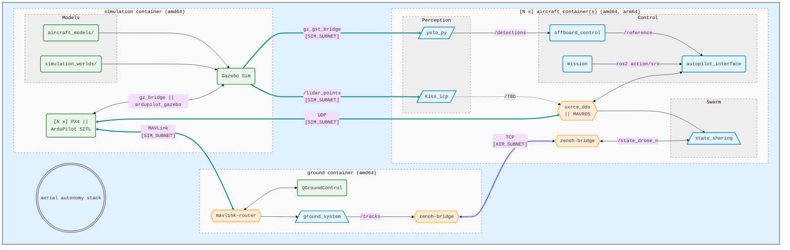

# aerial-autonomy-stack

*Aerial autonomy stack* (AAS) is an all-in-one software stack to:

1. **Develop** multi-drone autonomy—with ROS2, PX4, and ArduPilot
2. **Simulate** faster-than-real-time perception and control—with YOLO and 3D LiDAR
3. **Deploy** in real drones—with JetPack, DeepStream, and NVIDIA Orin

For an example bill of materials, read [`BOM.md`](/tools_and_docs/docs/BOM.md); for motivation, read [`RATIONALE.md`](/tools_and_docs/docs/RATIONALE.md)

https://github.com/user-attachments/assets/57e5bc91-8bee-4bae-8f81-a9aacef471e7

<details>
<summary><b>Features</b> <i>(click to expand)</i></summary>

- **PX4 and ArduPilot multi-vehicle** simulation (**quadrotors and VTOLs**)
- ROS2 action-based autopilot interface (*via* XRCE-DDS or MAVROS)
- **YOLO** (with ONNX GPU Runtimes) and **LiDAR** Odometry (with [KISS-ICP](https://github.com/PRBonn/kiss-icp))
- 3D worlds for perception-based simulation
- **Steppable** [Gymnasium environment](https://gymnasium.farama.org/index.html) and **faster-than-real-time**, **multi-instance** simulation
- Gazebo's wind effects and [waves](https://github.com/srmainwaring/asv_wave_sim) plugins
- **Dockerized simulation** based on [Ubuntu with CUDA and cuDNN](https://catalog.ngc.nvidia.com/orgs/nvidia/containers/cuda/tags)
- **Dockerized deployment** based on [NVIDIA JetPack](https://catalog.ngc.nvidia.com/orgs/nvidia/containers/l4t-jetpack/tags) with [DeepStream](https://docs.nvidia.com/metropolis/deepstream/dev-guide/text/DS_Installation.html#platform-and-os-compatibility)
- **Windows 11** compatibility *via* WSL
- Multi-**Jetson-in-the-loop (HITL) simulation** to test NVIDIA- and ARM-based on-board compute
- Dual network to separate simulated sensors (`SIM_SUBNET`) and inter-vehicle comms (`AIR_SUBNET`)
- [Zenoh](https://github.com/eclipse-zenoh/zenoh-plugin-ros2dds) inter-vehicle ROS2 bridge
- [PX4 Offboard](https://docs.px4.io/main/en/flight_modes/offboard.html) interface (e.g. CTBR/`VehicleRatesSetpoint` for agile, GNSS-denied flight) 
- [ArduPilot Guided](https://ardupilot.org/copter/docs/ac2_guidedmode.html) interface (i.e. `setpoint_velocity`, `setpoint_accel` references)
- Logs analysis with [`flight_review`](https://github.com/PX4/flight_review) (`.ulg`), MAVExplorer (`.bin`), and [PlotJuggler](https://github.com/facontidavide/PlotJuggler) (`rosbag`)
</details>

## 1. Installation

> AAS is developed on Ubuntu 24.04 with `nvidia-driver-580` using an i7-11 with 16GB RAM and RTX 3060
>
> Read [`REQUIREMENTS_UBUNTU.md`](/tools_and_docs/docs/REQUIREMENTS_UBUNTU.md) (or [`REQUIREMENTS_WSL.md`](/tools_and_docs/docs/REQUIREMENTS_WSL.md) for Windows 11) to install the requirements

```sh
sudo apt update && sudo apt install -y git xterm xfonts-base wget unzip
git clone https://github.com/JacopoPan/aerial-autonomy-stack.git && cd aerial-autonomy-stack/tools_and_docs/
./tests/check_requirements.sh                         # AAS requires nvidia-driver-580, docker, and nvidia-container-toolkit
./sim_build.sh                                        # The 1st build takes ~45' with good internet (`Ctrl + c` and restart if needed, cached stages will be preserved)
```

<details>
<summary><b>ghcr.io pre-built images</b> <i>(click to expand)</i>
<a href="https://github.com/JacopoPan/aerial-autonomy-stack/actions/workflows/aas-amd64-build-and-test.yml"></a>
</summary>

```sh
# ghcr.io images are re-built from `main` every Friday night
for name in aircraft ground simulation; do
  docker pull ghcr.io/jacopopan/${name}-image:latest
  docker tag ghcr.io/jacopopan/${name}-image:latest ${name}-image:latest
done
```
</details>

## 2. Simulation


On one terminal, start AAS:

```sh
cd aerial-autonomy-stack/tools_and_docs/
AUTOPILOT=px4 NUM_QUADS=1 NUM_VTOLS=1 WORLD=swiss_town HEADLESS=false RTF=3.0 ./sim_run.sh    # Start a simulation, check the script for more options (note: ArduPilot SITL checks take ~30s of simulated time before being ready to arm)
```

On another terminal, fly all drones:

```sh
for ID in {1..2}; do
  docker exec -d aircraft-container-inst0_$ID bash -c "source /opt/ros/humble/setup.bash &&
    source /aas/github_ws/install/setup.bash && source /aas/aircraft_ws/install/setup.bash &&
    ros2 run mission mission --conops yalla.yaml --ros-args -r __ns:=/Drone$ID -p use_sim_time:=true"
done
```

`./sim_run.sh` options:

```
- AUTOPILOT=px4, ardupilot
- HEADLESS/CAMERA/LIDAR=true, false
- NUM_QUADS/NUM_VTOLS=0, 1, ...
- WORLD=impalpable_greyness, apple_orchard, shibuya_crossing, swiss_town, waterworld
- RTF=1.0, 2.0, ... (real-time-factor, use 0.0 for "as fast as possible)
- INSTANCE=0, 1, ... (integer ID to run multiple parallel simulations)
```


> `WORLD`s:
> *(i)* `apple_orchard`, a GIS world created using [BlenderGIS](https://github.com/domlysz/BlenderGIS)
> / *(ii)* `impalpable_greyness`, an empty world with simple shapes
> / *(iii)* `shibuya_crossing`, a 3D world adapted from [cgtrader](https://www.cgtrader.com/)
> / *(iv)* `swiss_town`, a photogrammetry world courtesy of [Pix4D / pix4d.com](https://support.pix4d.com/hc/en-us/articles/360000235126)
> / *(v)* `waterworld`, a dynamic world using the [`asv_wave_sim`](https://github.com/srmainwaring/asv_wave_sim) wave plugin


> [!TIP]
> Edit [`sensor_config.yaml`](simulation/simulation_resources/aircraft_models/sensor_config.yaml), then run `sim_build.sh`, to customize the sensor parameters
>
> <details>
> <summary>Use ROS2 drone and gimbal <b>control primitives</b> from CLI <i>(click to expand)</i></summary>
>
> ```sh
> # Takeoff action (quads and VTOLs)
> cancellable_action "ros2 action send_goal /Drone${DRONE_ID}/takeoff_action autopilot_interface_msgs/action/Takeoff '{takeoff_altitude: 40.0, vtol_transition_heading: 330.0, vtol_loiter_nord: 200.0, vtol_loiter_east: 100.0, vtol_loiter_alt: 120.0}'"
>
> # Land (at home) action (quads and VTOLs)
> cancellable_action "ros2 action send_goal /Drone${DRONE_ID}/land_action autopilot_interface_msgs/action/Land '{landing_altitude: 60.0, vtol_transition_heading: 60.0}'"
>
> # Orbit action (quads and VTOLs)
> cancellable_action "ros2 action send_goal /Drone${DRONE_ID}/orbit_action autopilot_interface_msgs/action/Orbit '{east: 500.0, north: 0.0, altitude: 150.0, radius: 200.0}'"
>
> # Reposition service (quads only)
> ros2 service call /Drone${DRONE_ID}/set_reposition autopilot_interface_msgs/srv/SetReposition '{east: 50.0, north: 100.0, altitude: 60.0}'
>
> # Offboard action (PX4 quads and VTOLs offboard_setpoint_type: attitude = 0, rates = 1, trajectory = 2; ArduPilot quads offboard_setpoint_type: velocity = 3, acceleration = 4) 
> cancellable_action "ros2 action send_goal /Drone${DRONE_ID}/offboard_action autopilot_interface_msgs/action/Offboard '{offboard_setpoint_type: 1, max_duration_sec: 5.0}'"
>
> # SetSpeed service (always limited by the autopilot params, for quads applies from the next command, not effective on ArduPilot VTOLs) 
> ros2 service call /Drone${DRONE_ID}/set_speed autopilot_interface_msgs/srv/SetSpeed '{speed: 3.0}'
>
> # Gimbal status and position control (in radians)
> ros2 topic echo /gimbal_state
> ros2 topic pub -1 /gimbal_pitch_cmd std_msgs/msg/Float64 "{data: 1.57}"
> ```
> To analyze the flight logs in the `Simulation`'s Xterm terminal:
> ```sh
> /aas/simulation_resources/scripts/plot_logs.sh                                                # Analyze the flight logs at http://10.42.90.100:5006/browse or in MAVExplorer
> ```
>
> To create a new mission, re-implement [`test_mission.yaml`](/aircraft/aircraft_resources/missions/test_mission.yaml)
> </details>
> <details>
> <summary>Add or disable <b>wind effects</b>, in the <kbd>Simulation</kbd>'s Xterm terminal <i>(click to expand)</i></summary>
> 
> ```sh
> python3 /aas/simulation_resources/scripts/gz_wind.py --from_west 0.0 --from_south 3.0
> python3 /aas/simulation_resources/scripts/gz_wind.py --stop_wind
> ```
> </details>
> <details>
> <summary>Develop within <b>live containers</b> <i>(click to expand)</i></summary>
> 
> Launching the `sim_run.sh` script with `DEV=true`, does **not** start the simulation and mounts folders `[aircraft|ground|simulation]_resources`, `[aircraft|ground]_ws/src` as volumes to more easily track, commit, push changes while building and testing them within the containers:
> 
> ```sh
> cd aerial-autonomy-stack/tools_and_docs/
> DEV=true ./sim_run.sh                                                                       # Starts one simulation-image, one ground-image, and one aircraft-image where the *_resources/ and *_ws/src/ folders are mounted from the host
> ```
> 
> To build changes—**made on the host**—in the `Ground` or `QUAD` Xterm terminal:
> 
> ```sh
> cd /aas/aircraft_ws/                                                                        # Or cd /aas/ground_ws/
> colcon build --symlink-install
> ```
> 
> To start the simulation, in the `QUAD` Xterm terminal:
> 
> ```sh
> tmuxinator start -p /aas/aircraft.yml.erb
> ```
> 
> In the `Ground` Xterm terminal:
> ```sh
> tmuxinator start -p /aas/ground.yml.erb
> ```
> 
> In the `Simulation` Xterm terminal:
> ```sh
> tmuxinator start -p /aas/simulation.yml.erb
> ```
> 
> To end the simulation, in each terminal detach Tmux with `Ctrl + b`, then `d`; kill all lingering processes with `tmux kill-server && pkill -f gz`
> </details>

## 3. Jetson Deployment

> AAS is tested on a [Holybro Jetson Baseboard](https://holybro.com/products/pixhawk-jetson-baseboard) with Pixhawk 6X and NVIDIA Orin NX 16GB on an X650
>
> Read [`SETUP_AVIONICS.md`](/tools_and_docs/docs/SETUP_AVIONICS.md) and [`BOM.md`](/tools_and_docs/docs/BOM.md) to setup the requirements on the Jetson and configure the Pixhawk

```sh
sudo apt update && sudo apt install -y git
git clone https://github.com/JacopoPan/aerial-autonomy-stack.git && cd aerial-autonomy-stack/tools_and_docs/
./deploy_build.sh                                     # Build for arm64, on Jetson Orin NX the first build takes ~50', including building onnxruntime-gpu with TensorRT support from source
```

<a href="https://github.com/JacopoPan/aerial-autonomy-stack/actions/workflows/aircraft-arm64-build.yml"></a>

On a Jetson Orin, start the `aircraft-image`:

```sh
cd aerial-autonomy-stack/tools_and_docs/
AUTOPILOT=px4 DRONE_ID=1 CAMERA=true LIDAR=false AIR_SUBNET=10.223 HEADLESS=true ./deploy_run.sh
# The 1st run of `./deploy_run.sh` requires ~10' to build the FP16 TensorRT cache
```

`./deploy_run.sh` options:

```
- DRONE_TYPE=quad, vtol
- AUTOPILOT=px4, ardupilot
- DRONE_ID=1, 2, ... (ROS_DOMAIN_ID of the drone, matching the MAV_SYS_ID/SYSID_THISMAV of the autpilot)
- HEADLESS/CAMERA/LIDAR=true, false
```

On a laptop, start the `ground-image` (QGC, Zenoh, SSH, and GStreamer):

```sh
cd aerial-autonomy-stack/tools_and_docs/
./sim_build.sh                                        # Build all images for amd64, including ground-image
GROUND=true NUM_QUADS=1 AIR_SUBNET=10.223 HEADLESS=false ./deploy_run.sh
```

<details>
<summary><b>HITL Simulation</b> <i>(click to expand)</i></summary>

> **Note:** HITL simulation validates the Jetson compute and the inter-vehicle network. 
> Use USB2.0 ASIX Ethernet adapters to add multiple network interfaces to the Jetson baseboards

Set up a LAN on an arbitrary `SIM_SUBNET` with netmask `255.255.0.0` (e.g. `172.30.x.x`) between:

- One simulation computer, with IP `[SIM_SUBNET].90.100`
- One ground computer, with IP `[SIM_SUBNET].90.101`
- `N` Jetson Baseboards with IPs `[SIM_SUBNET].90.1`, ..., `[SIM_SUBNET].90.N`

> **Optionally**, set up a second LAN :`AIR_SUBNET` with netmask `255.255.0.0` (e.g. `10.223.x.x`) between:
> 
> - One ground computer, with IP `[AIR_SUBNET].90.101`
> - `N` Jetson Baseboards with IPs `[AIR_SUBNET].90.1`, ..., `[AIR_SUBNET].90.N` 

First, start all aircraft containers, one on each Jetson (e.g. *via* SSH):
```sh
# On the Jetson with IPs ending in 90.1
HITL=true DRONE_ID=1 SIM_SUBNET=172.30 AIR_SUBNET=10.223 ./deploy_run.sh                      # Add HEADLESS=false if a screen is connected to the Jetson
```

```sh
# On the Jetson with IPs ending in 90.2
HITL=true DRONE_ID=2 SIM_SUBNET=172.30 AIR_SUBNET=10.223 ./deploy_run.sh                      # Add HEADLESS=false if a screen is connected to the Jetson
```

Then, start the simulation:
```sh
# On the computer with IPs ending in 90.100
HITL=true NUM_QUADS=2 SIM_SUBNET=172.30 ./sim_run.sh
```

Finally, start QGC and the Zenoh bridge:
```sh
# On the computer with IPs ending in 90.101
HITL=true GROUND=true NUM_QUADS=2 AIR_SUBNET=10.223 HEADLESS=false ./deploy_run.sh
```

> **Note:** running only the first 3 commands with `GND_CONTAINER=false` puts the Zenoh bridge on the `SIM_SUBNET`, removing the need for the optional `AIR_SUBNET` and the computer with IP ending in `90.101`

Once done, detach Tmux (and remove the containers) with `Ctrl + b`, then `d`
</details>

## 4. Gymnasium Environment

<details>
<summary>Using a Python <kbd>venv</kbd> or a <a href="https://docs.conda.io/projects/conda/en/stable/user-guide/install/linux.html"><kbd>conda</kbd></a> environment is optional but recommended <i>(click to expand)</i></summary>

```sh
wget https://repo.anaconda.com/archive/Anaconda3-2025.12-2-Linux-x86_64.sh # Or a newer version in https://repo.anaconda.com/archive/
bash Anaconda3-2025.12-2-Linux-x86_64.sh              # Install; start a new terminal
conda config --set auto_activate_base false           # Turn off auto initialization of (base); start a new terminal
conda update --all -n base -c defaults                # Update to the latest conda version
conda create -n aas python=3.12                       # Latest Python version beyond "bugfix" status https://devguide.python.org/versions/
```
</details>

Install the `aas-gym` package (**after** completing the steps in ["Installation"](#1-installation)):
```sh
conda activate aas                                    # If using Anaconda
cd aerial-autonomy-stack/aas-gym/
pip3 install -e .
```

<a href="https://github.com/JacopoPan/aerial-autonomy-stack/actions/workflows/aas-gym-pip-install.yml"></a>

Examples:
```sh
conda activate aas                                    # If using Anaconda
cd aerial-autonomy-stack/tools_and_docs
python3 gym_run.py --mode step                        # Manually step AAS @1Hz
python3 gym_run.py --mode speedup                     # Speed-up test @50Hz
python3 gym_run.py --mode vectorenv-speedup           # Vectorized speed-up test @50Hz
```

## Citation

```bibtex
@INPROCEEDINGS{panerati2026aas,
    author={Jacopo Panerati and Sina Sajjadi and Sina Soleymanpour and Varunkumar Mehta and Iraj Mantegh},
    booktitle={2026 International Conference on Unmanned Aircraft Systems (ICUAS)},
    title={{aerial-autonomy-stack}---a faster-than-real-time, autopilot-agnostic, {ROS2} framework to simulate and deploy perception-based drones},
    year={2026}}
```

## Appendix: Architecture



<details>
<summary>Repository <b>structure</b> <i>(click to expand)</i></summary>

```sh
aerial-autonomy-stack
│
├── aas-gym
│   └── src
│       └── aas_gym
│           └── aas_env.py                            # aerial-autonomy-stack as a Gymnasium environment
│
├── aircraft
│   ├── aircraft_ws
│   │   └── src
│   │       ├── autopilot_interface                   # Ardupilot/PX4 high-level actions (Takeoff, Orbit, Offboard, Land)
│   │       ├── mission                               # Orchestrator of the actions in `autopilot_interface`
│   │       ├── offboard_control                      # Low-level references for the Offboard action in `autopilot_interface`
│   │       ├── state_sharing                         # Publisher of the `/state_sharing_drone_N` topic broadcasted by Zenoh
│   │       └── yolo_py                               # GStreamer video acquisition and publisher of YOLO bounding boxes
│   │
│   └── aircraft.yml.erb                              # Aircraft docker tmux entrypoint
│
├── ground
│   ├── ground_ws
│   │   └── src
│   │       └── ground_system                         # Publisher of topic `/tracks` broadcasted by Zenoh
│   │
│   └── ground.yml.erb                                # Ground docker tmux entrypoint
│
├── simulation
│   ├── simulation_resources
│   │   ├── aircraft_models
│   │   │   ├── alti_transition_quad                  # ArduPilot VTOL model
│   │   │   ├── iris_with_ardupilot                   # ArduPilot quad model
│   │   │   ├── sensor_camera                         # Camera model
│   │   │   ├── sensor_gimbal                         # 3D gimbal used with sensor_camera
│   │   │   ├── sensor_lidar                          # LiDAR model
│   │   │   ├── standard_vtol                         # PX4 VTOL model
│   │   │   ├── x500                                  # PX4 quad model
│   │   │   └── sensor_config.yaml                    # Intrinsics and extrinsics for all sensor and vehicle models
│   │   └── simulation_worlds
│   │       ├── apple_orchard.sdf
│   │       ├── impalpable_greyness.sdf
│   │       ├── shibuya_crossing.sdf
│   │       ├── swiss_town.sdf
│   │       └── waterworld.sdf
│   │
│   └── simulation.yml.erb                            # Simulation docker tmux entrypoint
│
└── tools_and_docs
    ├── docker
    │   ├── aircraft.dockerfile                       # Docker image for aircraft simulation and deployment
    │   ├── ground.dockerfile                         # Docker image for ground system simulation and deployment
    │   └── simulation.dockerfile                     # Docker image for SITL and HITL simulation
    │
    ├── deploy_build.sh                               # Build `aircraft.dockerfile` for arm64/Orin
    ├── deploy_run.sh                                 # Start the aircraft docker on arm64/Orin or the ground docker on amd64 (deploy or HITL)
    │
    ├── gym_run.py                                    # Examples for the Gymnasium aas-gym package
    │
    ├── sim_build.sh                                  # Build all dockerfiles for amd64/simulation
    └── sim_run.sh                                    # Start the simulation (SITL or HITL)
```
</details>

<details>
<summary><b>Dependencies</b> management <i>(click to expand)</i></summary>

- [x] Host OS: [Ubuntu 22.04/24.04/26.04 (LTS, ESM 4/2036)](https://ubuntu.com/about/release-cycle)
- [ ] Jetpack: [6.2.1 (rev. 1) [L4T 36.4.4, Ubuntu 22-based]](https://developer.nvidia.com/embedded/jetpack-archive)
    - **TODO: test on JP 6.2.2 [L4T 36.5.0, Ubuntu 22-based]**
- [x] [`nvidia-driver-580`](https://developer.nvidia.com/datacenter-driver-archive)
- [x] [Docker Engine v29](https://docs.docker.com/engine/release-notes/)
- [x] [NVIDIA Container Toolkit 1.19](https://docs.nvidia.com/datacenter/cloud-native/container-toolkit/latest/index.html)
- [x] `amd64` base image: [`cuda:12.9.1-cudnn-runtime-ubuntu22.04`](https://catalog.ngc.nvidia.com/orgs/nvidia/containers/cuda/tags)
- [x] `arm64`/Jetson base image: [`l4t-jetpack:r36.4.0`](https://catalog.ngc.nvidia.com/orgs/nvidia/containers/l4t-jetpack/tags)
- [x] [DeepStream 7.1](https://docs.nvidia.com/metropolis/deepstream/dev-guide/text/DS_Installation.html#platform-and-os-compatibility)
- [x] [ROS2 Humble (LTS, EOL 5/2027)](https://docs.ros.org/en/rolling/Releases.html)
- [x] [Gazebo Sim Harmonic (LTS, EOL 9/2028)](https://gazebosim.org/docs/latest/releases/)
- [x] [PX4 1.16.2](https://github.com/PX4/PX4-Autopilot/releases)
- [x] [ArduPilot 4.6.3](https://github.com/ArduPilot/ardupilot/releases)
- [x] [YOLO26](https://github.com/ultralytics/ultralytics/releases)
- [x] [ONNX Runtime 1.23.2](https://github.com/microsoft/onnxruntime/releases)

Transitive constraints (as of May 2026):

- Jetson Orin supports [JetPack only up to version 6](https://developer.nvidia.com/embedded/jetpack-archive)
  - JetPack 6/Orin latest supported DeepStream version is 7.1 (DS 8.0, 9.0 are on JetPack 7/Thor)
  - JetPack 6 is based on L4T 36 (Ubuntu 22)
    - Ubuntu 22's system Python is version 3.10
      - The last available ONNX Runtime GPU wheel for Python 3.10 is version 1.23.2 ([ORT 1.24+ is available on Python 3.11+](https://github.com/microsoft/onnxruntime/releases/tag/v1.24.1))
        - ONNX Runtime GPU 1.23.2 only supports CUDA 12 ([CUDA 13 added in ORT 1.24.1](https://github.com/microsoft/onnxruntime/releases/tag/v1.24.1))
          - The latest CUDA 12 on the [NVIDIA NGC Catalog](https://catalog.ngc.nvidia.com/orgs/nvidia/containers/cuda/tags) is 12.9.1 (e.g., `cuda:12.9.1-cudnn-runtime-ubuntu22.04`)
    - Ubuntu 22's GStreamer `apt` package is version 1.20
      - [GStreamer 1.20's `nvh264enc preset`s are no longer supported](https://docs.nvidia.com/video-technologies/video-codec-sdk/13.0/deprecation-notices/index.html) beyond `nvidia-driver-580`; `nvidia-driver-595` requires [GStreamer 1.24](https://discourse.gstreamer.org/t/nvcodec-nvenc-nvidia-deprecates-support-for-old-videocodec-sdk-h-264-hevc-encoder-presets-with-driver-r550-in-q124/182), which is the default on Ubuntu 24

External repositories:
- [`PX4/PX4-Autopilot`](https://github.com/PX4/PX4-Autopilot) tag/branch: `v1.16.2`
- [`PX4/px4_msgs`](https://github.com/PX4/px4_msgs) tag/branch: `release/1.16`
- [`PX4/flight_review`](https://github.com/PX4/flight_review) tag/branch: `main`
- [`ArduPilot/ardupilot`](https://github.com/ArduPilot/ardupilot) tag/branch: `Copter-4.6.3`
- [`ArduPilot/ardupilot_gazebo`](https://github.com/ArduPilot/ardupilot_gazebo) tag/branch: `main`
- [`srmainwaring/asv_wave_sim`](https://github.com/srmainwaring/asv_wave_sim) tag/branch: `master`
- [`mavlink/c_library_v2`](https://github.com/mavlink/c_library_v2) tag/branch: `master`
- [`mavlink-router/mavlink-router`](https://github.com/mavlink-router/mavlink-router) tag/branch: `master`
- [`eProsima/Micro-XRCE-DDS-Agent`](https://github.com/eProsima/Micro-XRCE-DDS-Agent) tag/branch: `master`
- [`PRBonn/kiss-icp`](https://github.com/PRBonn/kiss-icp) tag/branch: `main`
- [`microsoft/onnxruntime`](https://github.com/microsoft/onnxruntime) tag/branch: `v1.23.2`
- [`Livox-SDK/Livox-SDK2`](https://github.com/Livox-SDK/Livox-SDK2) tag/branch: `master`
- [`Livox-SDK/livox_ros_driver2`](https://github.com/Livox-SDK/livox_ros_driver2) tag/branch: `master`
</details>

---
> You've done a man's job, sir. I guess you're through, huh?

<!--

## RL WIP

```sh
python3 gym_run.py --mode learn
# debug
docker exec -it simulation-container-inst0 tmux attach
docker exec -it aircraft-container-inst0_1 tmux attach
```

## Known Issues

- ArduPilot SITL for Iris uses option -f that also sets "external": True, this is not the case for the Alti Transition from ArduPilot/SITL_Models
- QGC will only connect to the first 10 ArduPilot vehicles when GND_CONTAINER=false because of settings in QGroundControl.ini
- Gazebo WindEffects plugin affects cruise speeds and it is disabled for the standard_vtol's model.sdf.erb
- Command 178 MAV_CMD_DO_CHANGE_SPEED is accepted but not effective in changing speed for ArduPilot VTOL
- In ArdupilotInterface's action callbacks, std::shared_lock<std::shared_mutex> lock(node_data_mutex_); could be used on the reads of lat_, lon_, alt_
- QGC does not save roll and pitch in the telemetry bar for PX4 VTOLs (MAV_TYPE 22)
- PX4 quad max tilt is limited by the anti-windup gain (zero it to deactivate it): const float arw_gain = 2.f / _gain_vel_p(0);

## Docker Basics

```sh
# Stop and remove all containers and networks
docker stop $(docker ps -q) && docker container prune -f && docker network prune -f

docker ps -a                          # List containers
docker stop $(docker ps -q)           # Stop all containers
docker container prune -f             # Remove all stopped containers

docker network ls                     # List docker networks
docker network rm <network_name>      # Remove a specific network
docker network prune -f               # Remove all unused networks
docker system df                      # Check disk usage by images and cache
docker system prune                   # Remove stopped containers, unused networks and cache, dangling images

docker images                         # List images
docker image prune                    # Remove untagged images
docker rmi <image_name_or_id>         # Remove a specific image
docker builder prune                  # Clear all dangling cache
```

## Tmux Shortcuts

```sh
tmux list-sessions                    # List all sessions
tmux attach-session -t [session_name] # Reattach a session
tmux kill-session -t [session_name]   # Kill a session
tmux kill-server                      # Kill all sessions

Ctrl + b, then n, p                   # Move between Tmux windows
Ctrl + b, then [arrow keys]           # Move between Tmux panes in a window (or use the mouse)
Ctrl + [, then [arrow keys]           # Enter copy mode (to scroll back in a pane, or simply select-and-drag with the mouse to copy)
Space                                 # Start selecting when in copy mode (move with arrow keys)
y                                     # Yank/copy the selection to clipboard (paste with Ctrl + v or Ctrl + Shit + v)
q                                     # Exit copy mode
Ctrl + b, then "                      # Split a Tmux window horizontally
Ctrl + b, then %                      # Split a Tmux window vertically
Ctrl + b, then d                      # Detach Tmux
```

## Future Work

### Support for Gazebo Sim and Betaflight SITL

- https://www.betaflight.com/docs/development/SITL
- https://github.com/betaflight/betaloop
- https://github.com/betaflight/aeroloop_gazebo
- https://github.com/utiasDSL/gym-pybullet-drones/blob/a8c238c21c7586ee1735bafb358a4d5637402f14/gym_pybullet_drones/envs/BetaAviary.py#L111C1-L172C56

### Potential for technical spikes/long-term, nice-to-have features

- Integrate a GIS world generator (e.g., Cesium)
    - https://github.com/CesiumGS/cesium-native
- Integrate a photorealistic simulator (e.g., IsaacSim)
    - https://github.com/PegasusSimulator/PegasusSimulator
- Integrate more realistic flight dynamics (e.g., JSBSim)
    - https://github.com/JSBSim-Team/jsbsim
- Integrate a VLA model bridging the `yolo_py` and `mission` packages
- Re-instate Gazebo Sim support for Pixhawk HITL simulation using MAVLink HIL_ interface
    - https://mavlink.io/en/messages/common.html
    - https://github.com/tiiuae/px4-gzsim-plugins/
    - https://docs.px4.io/main/en/simulation/hitl
    - https://ardupilot.org/dev/docs/hitl-simulators.html

## License

Distributed under the MIT License. See `LICENSE.txt` for more information. Copyright (c) 2025 Jacopo Panerati

-->
